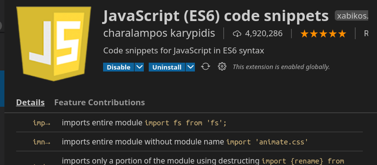
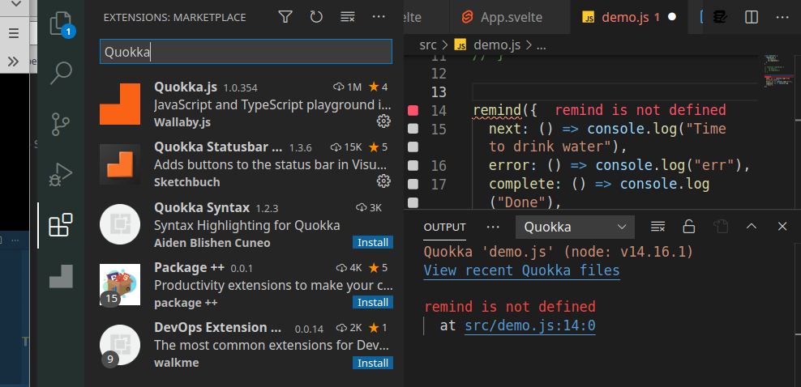
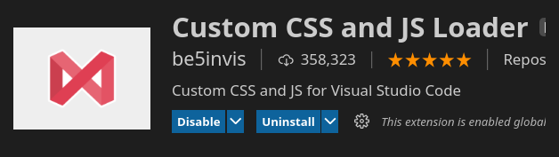
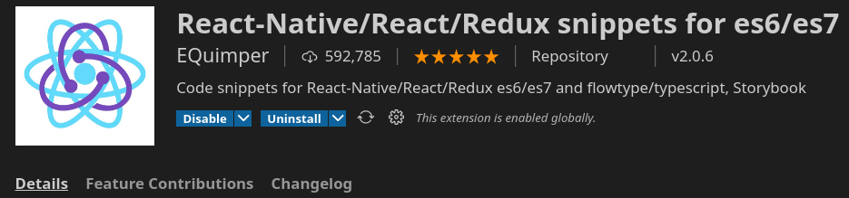
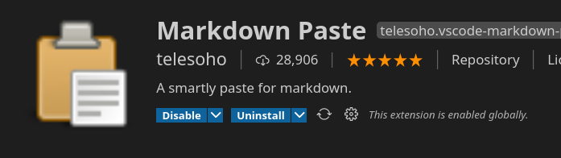
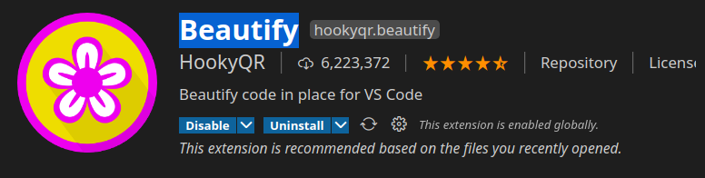
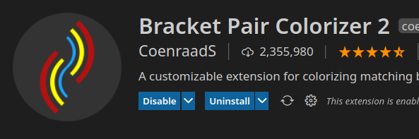
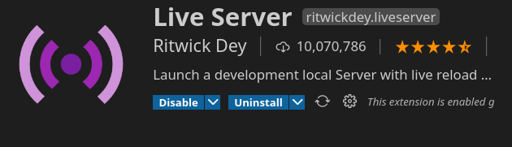
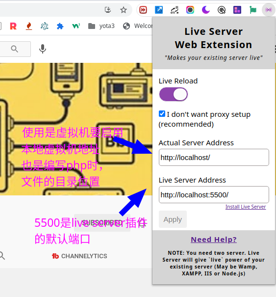
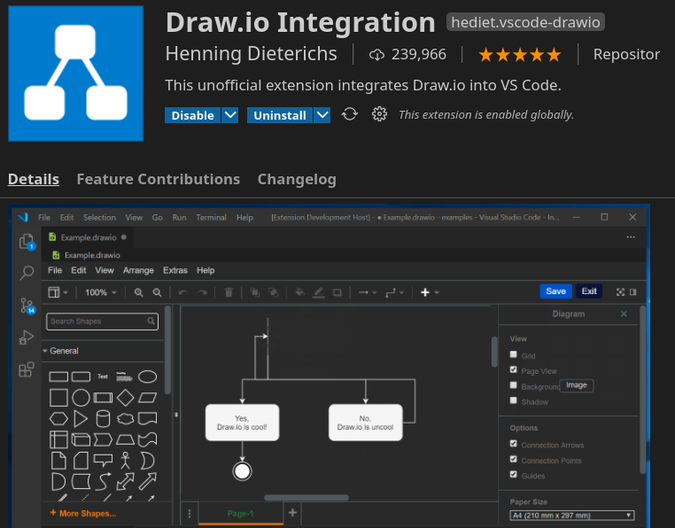

# vscode 常用插件

## react 和 react native JS 相关插件

**Code Runner **

必备的运行测试软件，支持几乎所有的流行计算机语言

安装后进行适当的设置：

1. 在快捷键设在中，添加一个快捷键，我给设置成 alt + a
2. 在 user settings --> extentions --> run code configuration --> Save file before run 这里要打上勾，当你点击 alt+a 时，是保存然后运行，所以代码是最新，刚刚输入的

### Advanced New File 自由创建新文件 

### File Utils 文件重命名 删除 移动 等功能

### **JavaScript (ES6) code snippets**\



es6 标准，插件的说明，附有大量的空间输入方式，大大的提高打码的开发效率

### Quokka javascript 和 typescript 即时反馈工具

超级有用的实时反馈调试插件
使用方法： f1 =》 搜索 Quokka 应用的当前文件（请提前先把要使用的文件打开）



> 这个插件有个不足的地方就是，显示的提示和编辑器文字的颜色混淆在一起，经常看混了，改善的方法是，给显示的文字，配上背景颜色

####  具体流程如下：

 在编辑器中，点 help --> Toggle Developer Tool --> 和调试 css一样，挑选并做修改，以下是我根据检查器捕捉到的class, 修改的结果，代码仅供参考，实际修改需要根据自己的环境做适当的调整：
 

``` css
.vs-dark.monaco-editor .ced-1-TextEditorDecorationType9-4::after,
.hc-black.monaco-editor .ced-1-TextEditorDecorationType9-4::after {
    margin: 1.2em;
    color: rgb(86, 156, 214) !important;
    /* 背景颜色请根据自己的需要自定义 */
    background-color: black;
}
```

**注意**： 用以上方法修改后，每次重启vs code编辑器时，都会被重置，所以这种方法不理想，要一劳永逸解决这个问题，请配合 Custom CSS and JS Loader 这个插件来使用

### Custom CSS and JS Loader 自定义 vs code



配置有点繁琐，请先阅读一下官方说明，我的是ubuntu系统，以下是我配置的流程：

1. 安装插件，并在 settings.json 添加 

``` json
// [""]里面添加你要自定义css文件的路径，留空无效，创建vscode-custom-css.css文件后，点右键，给足访问权限，文件名示例 ["file:////home/用户名/vscode-custom-css.css"] 

   "vscode_custom_css.imports": [""]

   ```

2. 在命令行修改拥有者权限

``` 

$ sudo chown -R $(whoami) /usr/share/code

```

3. 点 F1 搜索 "Enable Custom Css And Js",并点击执行，跳出提示后，确认，并执行
4. 完成后，重新启动 vs code
5. 如果一切配置顺利，此时，你在 vscode-custom-css.css 配置的自定义css文件效果将会被渲染

### **JavaScript Snippet Pack**\

和 js 相关的快捷键请参考插件说明

### **React Standard Style code snippets**\

包含 react 标准的经典样本

### **React-Native/React/Redux snippets for es6/es7**\



开发 react 必备

## docker 插件

### **Docker**

## markdown 插件

* **markdown-formatter** \

  编写 md 文件效率大增，使用前请把这段代码添加到 settings.json

``` 

"[markdown]": {
  // 快速补全
  "editor.quickSuggestions": {
    "other": true,
    "comments": true,
    "strings": true
  },
}

```

### **Markdown All in One** \

### code-translate 鼠标悬停翻译 很方便 

满足基本的需求，预览窗口，语法高亮等

### **Markdown Paste** \



可以快速的把网页的内容，粘帖到文档中，粘帖快捷键为 Ctrl+Alt+V，用这款插件，必须要安装插件才能工作, 请根据自己的系统安装如下插件：

``` 

    'xclip' command be required (Linux)
    'powershell' command be required (Win32)
    'pbpaste' command be required (Mac)
```

### **Markdown Preview Github Styling** \

显示 github 风格

### **Markdown Shortcuts** \

右键有 markdown 格式的相关功能

## 格式化工具

### **Prettier - Code formatter**


非常不错的，格式化工具，可以看看

### **Beautify**



web 套件格式化工具，主要是 html css javascript 和 json

## css 工具

### **Sass Formatter** \

sass 格式化工具

### **Live Sass Compiler**\

sass 动态编译，点一下下边栏的眼睛图标，即时的转换 scss=》css


## 技巧与效率工具

### **Window Colors**\


工作时，经常需要打开多个 vs code 窗口，这个插件最大的好处就是，在新开的窗口，会自动的改变颜色，方便识别，在多个窗口间来回切换也不会造成混乱

### **Path Intellisense**\

快捷的路径工具

### **Material Icon Theme**\

更完美的 icon，方便识别，在标签的头部也有图标

### Bracket Pair Colorizer 2

点击刮号，可快速的标出两个刮号间的内容，颜色高亮显示



### **Bracket Select**\

快速选定括号内的内容，方便删除或者修改，这里需要注意的是，插件默认的快捷键为 alt+a，毕竟不是非常常用的命令，为防止误操作我改成 alt+9

### **Comment Translate** \


注释区自动翻译，非注释区只需要选中文本，鼠标轻微移动一下，也可以翻译，有时用得上

### **Preview on Web Server**


提供 web 服务器服务，可以在 web 和浏览器两个窗口浏览

### **Live Server**\

实时预览工具，非常实用，在浏览器中，跳出文件夹，文件夹内的文件都可以预览



如果要**预览 php 文件**，本地需预装 php 环境并启用，并配合 chrome 浏览器**Live Server Web Extension**插件实现实时，转向预览，也就是，你输入 php 内容，点击保存时，文件可以实现实时同步



### **vscode-pdf**\

浏览 pdf 文件

### **Draw.io Integration**\



最好用的图形化画图软件\
**技巧说明**: 默认文件格式为 test.drawio 格式, 双击即可打开开始编辑，编辑完成后，保留成 svg 格式，即可在网页上显示，也可以直接修改 svg 文件，当然，如果你保持好 svg 文件，又希望在 Draw.io Integration 中编辑，可以保持成： test.drawio.svg

### **Preview on Web Server**\

这个插件，编辑 html 文件，可以在浏览器和编辑器右侧同步浏览

### **Prettier - Code formatter**\

非常实用的格式化软件 支持格式非常丰富

``` 

JavaScript · TypeScript · Flow · JSX · JSON
CSS · SCSS · Less
HTML · Vue · Angular
GraphQL · Markdown · YAML
```

\*\*\*\*\

### javascript 和 typeScript 辅助插件
